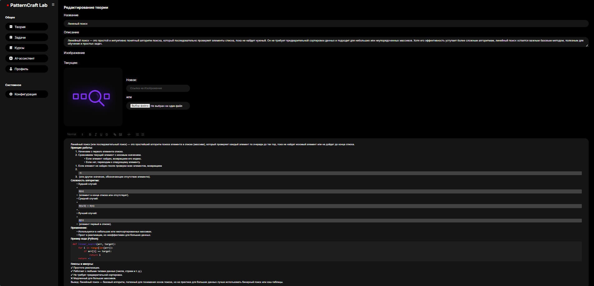
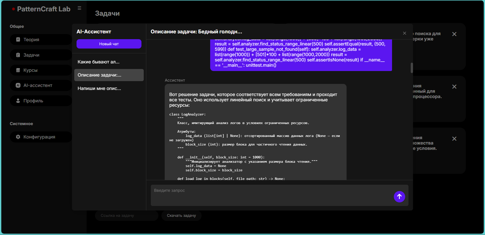
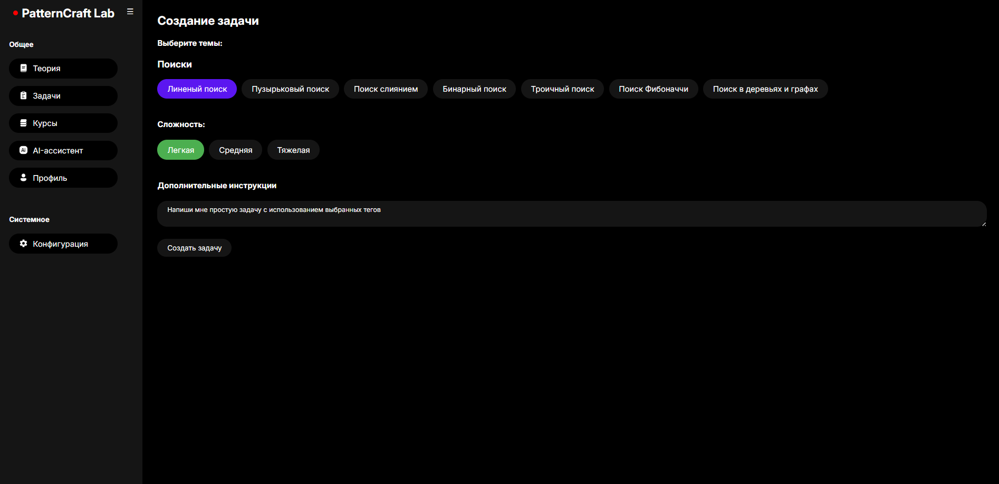
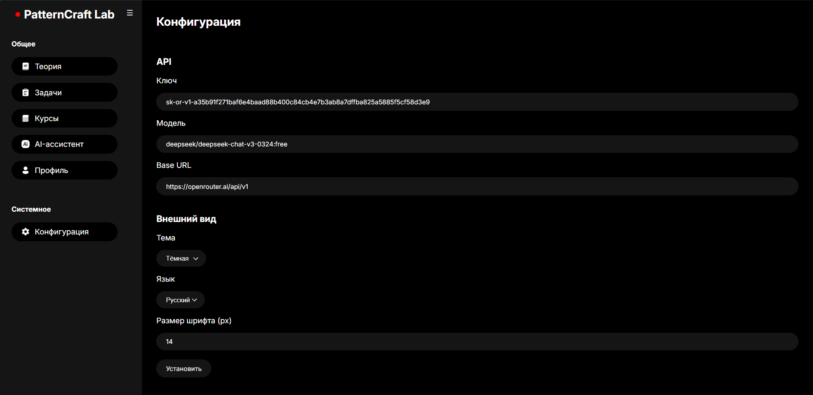

# PatternCraft-Lab

## Project Description
**PatternCraft Lab** is an universal instrument. You can use it as self-education tool or you can use it as interactive learning platform that combines theory, AI-driven explanations, and dynamic task generation to learn and teach programming. It is aimed at learners at various levels and educators.
We implemented PCL as a web application on your localhost, because it's a most simple solution and it reduces server load.
PCL supports only Python.
Created as a semester final project by a team of students to support programming education.

## What Does the Solution Include?
**1) Theory Creation:**  
• Using Lab interface with implemented Quill text redactor you can easily create a course for your students or make notes while learning new topic. 

**2) AI Tutor**  
• Built-in chats with a bot. The AI Tutor answers questions like 'What is a for loop?' based on the current theory page’s content.

**3) Problem Generator:**  
• Creates problems with any scenario you like. Enter a prompt like 'Calculate the sum of an array,' and the tool generates a task with sample unit tests.

**4) AI Expert**  
• The AI Expert reviews code for syntax errors, logic issues, and style, offering suggestions like ‘Consider using a list comprehension here'.

**5) Tests for problems**  
• Unit tests are auto-generated based on the problem scenario but may need tweaking for edge cases. Edit them in the provided test editor to ensure accuracy.

**6) Web Service with accounts**  
• The Web Service is an optional server-based extension that enables collaborative features like sharing courses and problems. Connect to it via the Lab interface after setting up your own server.
• Private/public storage for shared courses, problems, and solutions. Private content, such as a teacher’s custom course with theory and problems, can be shared with students via links to these resources, secured by random IDs.
• Registration/login are implemented. You can connect to your account via interface of Lab, to use Web Service benefits
• No user data is being collected and processed by us. The only sensitive information used by the Web Service and stored on your server is the users' email addresses.

**7) Two language support**
• Right now you can switch between English and Russian languages.

**8) Third-party API AI models (Openrouter)**
• To use AI features login into Openrouter, get token, paste it into your PCL and specify available model.

## Demo video
Below is a demonstration of PatternCraft-Lab in action:

<video controls>
  <source src="docs/demo.mp4" type="video/mp4">
  Your browser does not support the video tag.
</video>

## Getting started
• Download and run .exe file on Windows.
• To use Web Service host it on your server

## Contribution
To contribute, fork the repo, submit a pull request, or report issues on GitHub. The project is no longer actively maintained as of June 26, 2025, but contributions are welcome. You can try to contact with someone from the team. Here is our mail: noreply.pgr@gmail.com.

## License
This project is licensed under the MIT License. See the LICENSE file for details.

## Third-Party Components
This project uses the following AI model:
- Models accessed via OpenRouter are subject to their respective licenses or terms, as outlined at https://openrouter.ai/terms.